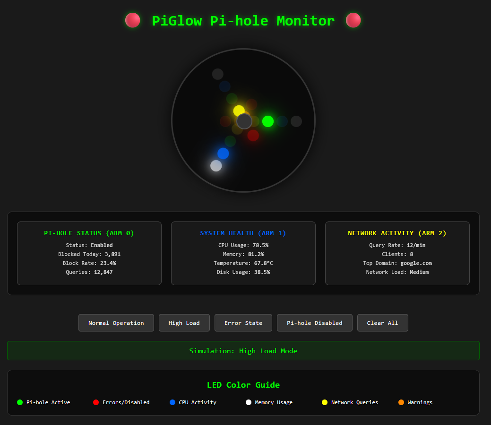

# Pi-hole PiGlow Monitor 🔴

[](https://mlake1.github.io/pihole-piglow-monitor/)
[](https://shop.pimoroni.com/products/piglow)
[](https://pi-hole.net/)


A beautiful visual status monitor for Pi-hole using the PiGlow LED add-on board for Raspberry Pi. Get real-time visual feedback about your Pi-hole's blocking activity, system health, and network status through colorful LED patterns.




## 🎮 Interactive Demo

**[→ Try the Live Demo](https://mlake1.github.io/pi-piglow-monitor/)** 

[](https://mlake1.github.io/pi-piglow-monitor/)

See exactly how PiGlow will look in action! The interactive demo shows all LED patterns and monitoring states.


## Features

- **Real-time Pi-hole Status** - Visual indication of blocking activity and service status
- **System Health Monitoring** - CPU, memory, temperature, and disk usage visualization
- **Network Activity Display** - Query rates and blocking statistics
- **Color-coded LED Patterns** - Intuitive color mapping for different metrics
- **Auto-startup Service** - Runs automatically on boot
- **Error Alerting** - Flashing patterns for service failures or high temperature warnings

## LED Layout

The PiGlow has 18 LEDs arranged in 3 arms with 6 colors each. This monitor uses the following mapping:

### Arm 0 (Top-right) - Pi-hole Status
- **🟢 Green LEDs**: Pi-hole is active and blocking (brightness = blocking percentage)
- **🔴 Red LEDs**: Pi-hole disabled or connection errors
- **🟠 Orange LEDs**: Service warnings or API issues

### Arm 1 (Bottom) - System Health
- **🔵 Blue LEDs**: CPU usage intensity
- **⚪ White LEDs**: Memory usage intensity
- **🟠 Orange LEDs**: Temperature warnings (>60°C)
- **🔴 Red LEDs**: Critical temperature (>70°C)

### Arm 2 (Top-left) - Network Activity
- **🟡 Yellow LEDs**: DNS query volume (scaled)
- **🔴 Red LEDs**: High blocking activity
- **⚪ White LEDs**: Connected clients indicator

## Requirements

### Hardware
- Raspberry Pi (any model with GPIO)
- [PiGlow LED add-on board](https://shop.pimoroni.com/products/piglow)
- Pi-hole installed and running

### Software
- Raspberry Pi OS (Bullseye or newer recommended)
- Python 3.7+
- Pi-hole API accessible on localhost

## Installation

### 1. Hardware Setup

1. **Power down** your Raspberry Pi completely
2. **Connect the PiGlow** to the GPIO pins (first 26 pins)
3. **Power on** your Raspberry Pi

### 2. Quick Install (Recommended)

```bash
# Clone this repository
git clone https://github.com/mlake1/pihole-piglow-monitor.git
cd pihole-piglow-monitor

# Run the install script
chmod +x install.sh
sudo ./install.sh
```

### 3. Manual Installation

#### Install Dependencies
```bash
# Update system
sudo apt update && sudo apt upgrade -y

# Install required packages
sudo apt install -y python3-pip python3-dev

# Install Python libraries
sudo pip3 install piglow requests psutil
```

#### Enable I2C
```bash
# Enable I2C interface
sudo raspi-config
# Navigate to: Interface Options → I2C → Enable
# Or run directly:
echo 'dtparam=i2c_arm=on' | sudo tee -a /boot/config.txt
```

#### Install the Monitor
```bash
# Copy files
sudo cp pihole_monitor.py /opt/pihole-piglow/
sudo chmod +x /opt/pihole-piglow/pihole_monitor.py

# Install systemd service
sudo cp pihole-piglow.service /etc/systemd/system/
sudo systemctl daemon-reload
sudo systemctl enable pihole-piglow.service
```

### 4. Configuration

Edit the configuration file to customize settings:

```bash
sudo nano /opt/pihole-piglow/config.json
```

```json
{
    "pihole_api_url": "http://localhost/admin/api.php",
    "update_interval": 10,
    "temperature_warning": 60,
    "temperature_critical": 70,
    "cpu_warning": 80,
    "memory_warning": 85,
    "brightness_scale": 1.0,
    "enable_startup_animation": true
}
```

## Usage

### Start the Monitor
```bash
# Start immediately
sudo systemctl start pihole-piglow.service

# Check status
sudo systemctl status pihole-piglow.service

# View logs
sudo journalctl -u pihole-piglow.service -f
```

### Test Mode
```bash
# Quick status check (10 seconds)
python3 pihole_monitor.py test

# Manual run (Ctrl+C to stop)
python3 pihole_monitor.py
```

### Stop the Monitor
```bash
sudo systemctl stop pihole-piglow.service

# Disable auto-start
sudo systemctl disable pihole-piglow.service
```

## File Structure

```
pihole-piglow-monitor/
├── README.md                 # This file
├── pihole_monitor.py         # Main monitor script
├── config.json              # Configuration file
├── install.sh               # Automated installer
├── pihole-piglow.service    # Systemd service file
├── demo.html                # Interactive web demo
└── examples/
    ├── simple_test.py       # Basic PiGlow test
    ├── piglow_effects.py    # Fun LED effects
    └── api_test.py          # Pi-hole API test
```

## Troubleshooting

### PiGlow Not Working
```bash
# Check I2C is enabled
sudo i2cdetect -y 1
# Should show device at address 0x54

# Test PiGlow directly
python3 examples/simple_test.py
```

### Pi-hole API Issues
```bash
# Test API connectivity
curl http://localhost/admin/api.php

# Check Pi-hole status
pihole status

# Verify API permissions
python3 examples/api_test.py
```

### Service Won't Start
```bash
# Check service logs
sudo journalctl -u pihole-piglow.service --no-pager

# Check file permissions
ls -la /opt/pihole-piglow/

# Test script manually
cd /opt/pihole-piglow/
python3 pihole_monitor.py test
```

### Common Issues

| Issue | Solution |
|-------|----------|
| LEDs don't light up | Enable I2C, check PiGlow connection |
| "Pi-hole API not accessible" | Verify Pi-hole is running, check API URL |
| High CPU usage | Increase `update_interval` in config |
| Service fails to start | Check Python dependencies, file permissions |
| LEDs stay red | Check Pi-hole status, API connectivity |

## Customization

### Custom LED Patterns

Create your own effects by modifying the display functions:

```python
def custom_pattern(self):
    # Your custom LED pattern here
    for i in range(6):
        self.piglow.led(i, 100)
        time.sleep(0.1)
```

### Additional Metrics

Extend the monitor to show more data:

```python
def get_network_stats(self):
    # Add network bandwidth monitoring
    # Add DNS response times
    # Add client device counts
    pass
```

### Web Dashboard Integration

The included `demo.html` can be served locally to provide a web-based view:

```bash
# Simple web server
cd pihole-piglow-monitor
python3 -m http.server 8080

# Access at: http://your-pi-ip:8080/demo.html
```

## LED Behavior Examples

### Normal Operation
- **Arm 0**: Steady green (brightness = blocking %)
- **Arm 1**: Low blue (CPU), medium white (memory)
- **Arm 2**: Gentle yellow pulsing (queries)

### High Load
- **Arm 0**: Bright green (active blocking)
- **Arm 1**: Bright blue (high CPU), orange warning (temp)
- **Arm 2**: Fast yellow flashing (many queries)

### Error States
- **Connection Error**: All arms flash red/orange
- **Pi-hole Disabled**: Arm 0 solid red
- **High Temperature**: Arm 1 red warning
- **API Timeout**: Orange flashing on arm 0

## Performance Notes

- **CPU Usage**: ~1-2% on Raspberry Pi 4
- **Memory**: ~15MB RAM usage
- **Update Frequency**: Default 10 seconds (configurable)
- **Power**: PiGlow draws ~200mA at full brightness

## Contributing

1. Fork the repository
2. Create a feature branch (`git checkout -b feature/amazing-feature`)
3. Commit your changes (`git commit -m 'Add amazing feature'`)
4. Push to the branch (`git push origin feature/amazing-feature`)
5. Open a Pull Request

### Development Setup
```bash
# Install development dependencies
pip3 install pytest black flake8

# Run tests
python3 -m pytest tests/

# Format code
black pihole_monitor.py

# Lint code
flake8 pihole_monitor.py
```

## License

This project is licensed under the GPL v3 License - see the [LICENSE](LICENSE) file for details.

## Acknowledgments

- [Pimoroni](https://pimoroni.com/) for the excellent PiGlow hardware
- [Pi-hole](https://pi-hole.net/) team for the amazing DNS sinkhole
- Raspberry Pi Foundation for the fantastic platform

## Support

- **Issues**: [GitHub Issues](https://github.com/mlake1/pihole-piglow-monitor/issues)
- **Pi-hole Community**: [Pi-hole Discourse](https://discourse.pi-hole.net/)

---

**Enjoy your glowing Pi-hole monitor!** 🌟

For questions or support, please open an issue on GitHub or join the discussion in our community forums.